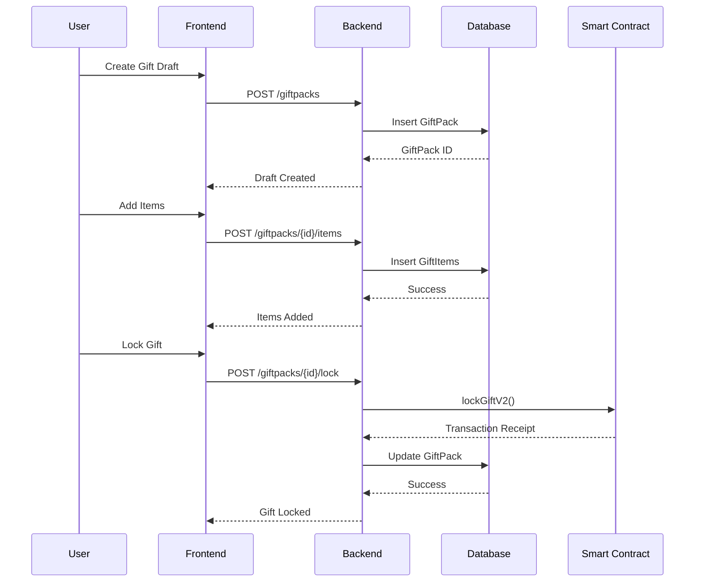
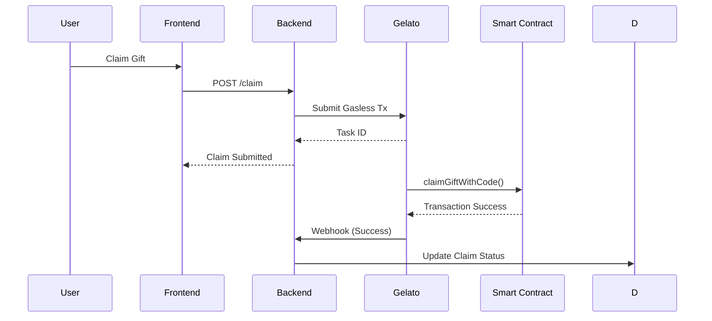

# 🏗️ DogeGift Architecture Documentation

## System Overview

DogeGift is a full-stack decentralized application that combines traditional web technologies with blockchain smart contracts to enable secure digital gifting. The architecture follows a hybrid approach, using databases for user experience optimization and blockchain for security and decentralization.

## Architecture Principles

### 🎯 Design Philosophy
- **Hybrid Architecture**: Database + Blockchain for optimal UX/security balance
- **Progressive Decentralization**: Start with centralized UX, enhance with blockchain
- **Security First**: Smart contracts handle all asset transfers
- **User-Centric**: Gasless experience for end users
- **Scalable**: Modular design for easy extension

### 🔧 Technical Principles
- **Microservices**: Separated concerns with clear boundaries
- **API-First**: RESTful APIs with OpenAPI specification
- **Type Safety**: Full TypeScript coverage
- **Test-Driven**: Comprehensive testing at all levels
- **Containerized**: Docker for consistent deployments

## System Architecture

```
┌─────────────────────────────────────────────────────────────┐
│                    Client Layer                             │
├─────────────────────────────────────────────────────────────┤
│  ┌─────────────────┐    ┌─────────────────┐                 │
│  │   Web Browser   │    │   Mobile App    │                 │
│  │   (Next.js)     │    │   (React Native)│                 │
│  └─────────────────┘    └─────────────────┘                 │
└─────────────────────────────────────────────────────────────┘
                                 │
                                 ▼
┌─────────────────────────────────────────────────────────────┐
│                   API Gateway Layer                         │
├─────────────────────────────────────────────────────────────┤
│  ┌─────────────────┐    ┌─────────────────┐    ┌─────────┐  │
│  │   Load Balancer │    │   API Gateway   │    │   CDN   │  │
│  │   (Nginx)       │    │   (Kong)        │    │ (Cloud- │  │
│  └─────────────────┘    └─────────────────┘    │  Flare)│  │
└─────────────────────────────────────────────────────────────┘
                                 │
                                 ▼
┌─────────────────────────────────────────────────────────────┐
│                 Application Layer                           │
├─────────────────────────────────────────────────────────────┤
│  ┌─────────────────┐    ┌─────────────────┐    ┌─────────┐  │
│  │   Frontend      │    │   Backend API   │    │   Admin │  │
│  │   (Next.js)     │    │   (NestJS)      │    │  Panel  │  │
│  └─────────────────┘    └─────────────────┘    └─────────┘  │
└─────────────────────────────────────────────────────────────┘
                                 │
                                 ▼
┌─────────────────────────────────────────────────────────────┐
│                 Data Layer                                  │
├─────────────────────────────────────────────────────────────┤
│  ┌─────────────────┐    ┌─────────────────┐    ┌─────────┐  │
│  │   PostgreSQL    │    │   Redis Cache   │    │   IPFS  │  │
│  │   (Primary DB)  │    │   (Sessions)    │    │ (Assets)│  │
│  └─────────────────┘    └─────────────────┘    └─────────┘  │
└─────────────────────────────────────────────────────────────┘
                                 │
                                 ▼
┌─────────────────────────────────────────────────────────────┐
│                 Blockchain Layer                            │
├─────────────────────────────────────────────────────────────┤
│  ┌─────────────────┐    ┌─────────────────┐    ┌─────────┐  │
│  │ Smart Contracts │    │   Oracle        │    │   DEX   │  │
│  │ (GiftEscrow)    │    │   (Chainlink)   │    │ (Uniswap│  │
│  └─────────────────┘    └─────────────────┘    │  V3)    │  │
└─────────────────────────────────────────────────────────────┘
```

## Component Architecture

### Frontend Architecture

#### Next.js App Router Structure
```
frontend/
├── app/                          # App Router Pages
│   ├── (auth)/                   # Authentication Routes
│   ├── (dashboard)/              # User Dashboard
│   ├── gift/                     # Gift Creation Flow
│   ├── claim/                    # Gift Claiming Flow
│   ├── api/                      # API Routes
│   └── globals.css               # Global Styles
├── components/                   # Reusable Components
│   ├── ui/                       # Base UI Components
│   ├── forms/                    # Form Components
│   ├── wallet/                   # Wallet Integration
│   └── gift/                     # Gift Components
├── lib/                          # Utilities
│   ├── api/                      # API Client
│   ├── web3/                     # Web3 Utilities
│   ├── validation/               # Form Validation
│   └── constants/                # App Constants
├── hooks/                        # React Hooks
├── context/                      # React Context
├── types/                        # TypeScript Types
└── public/                       # Static Assets
```

#### State Management
```typescript
// Context Architecture
<WalletProvider>
  <EscrowProvider>
    <ThemeProvider>
      <App />
    </ThemeProvider>
  </EscrowProvider>
</WalletProvider>

// Query Management
const queryClient = new QueryClient({
  defaultOptions: {
    queries: {
      staleTime: 5 * 60 * 1000, // 5 minutes
      cacheTime: 10 * 60 * 1000, // 10 minutes
    },
  },
});
```

### Backend Architecture

#### NestJS Module Structure
```
backend/
├── src/
│   ├── app.module.ts             # Root Module
│   ├── main.ts                   # Application Entry
│   ├── config/                   # Configuration Module
│   │   ├── config.module.ts
│   │   ├── database.config.ts
│   │   └── blockchain.config.ts
│   ├── auth/                     # Authentication Module
│   │   ├── auth.module.ts
│   │   ├── auth.controller.ts
│   │   ├── auth.service.ts
│   │   ├── siwe.strategy.ts
│   │   └── dto/
│   ├── assets/                   # Asset Management
│   │   ├── assets.module.ts
│   │   ├── assets.controller.ts
│   │   ├── assets.service.ts
│   │   └── dto/
│   ├── giftpacks/                # Gift Pack Management
│   │   ├── giftpacks.module.ts
│   │   ├── giftpacks.controller.ts
│   │   ├── giftpacks.service.ts
│   │   └── dto/
│   ├── claim/                    # Claim Processing
│   │   ├── claim.module.ts
│   │   ├── claim.controller.ts
│   │   ├── claim.service.ts
│   │   └── dto/
│   ├── common/                   # Shared Components
│   │   ├── decorators/
│   │   ├── guards/
│   │   ├── interceptors/
│   │   ├── filters/
│   │   └── dto/
│   └── prisma/                   # Database Client
```

#### Service Layer Architecture
```typescript
@Injectable()
export class GiftpacksService {
  constructor(
    private prisma: PrismaService,
    private blockchain: BlockchainService,
    private config: ConfigService,
  ) {}

  async createGiftPack(data: CreateGiftPackDto): Promise<GiftPack> {
    // Business logic implementation
  }

  async lockGiftPack(id: string): Promise<LockResult> {
    // Blockchain integration
  }
}
```

### Database Architecture

#### Prisma Schema Design
```prisma
// Core Entities
model User {
  id        String   @id @default(uuid())
  address   String   @unique @db.VarChar(42)
  createdAt DateTime @default(now())
  updatedAt DateTime @updatedAt

  giftPacks GiftPack[]
  claims    Claim[]
}

model GiftPack {
  id            String      @id @default(uuid())
  sender        User        @relation(fields: [senderId], references: [id])
  senderId      String
  status        GiftStatus  @default(DRAFT)
  giftIdOnChain Int?        @unique
  giftCode      String?     @unique
  expiry        DateTime
  message       String?
  createdAt     DateTime    @default(now())
  updatedAt     DateTime    @updatedAt

  items      GiftItem[]
  claims     Claim[]
}

model GiftItem {
  id         String    @id @default(uuid())
  giftPack   GiftPack  @relation(fields: [giftPackId], references: [id])
  giftPackId String
  type       AssetType
  contract   String
  tokenId    String?
  amount     String?
  createdAt  DateTime  @default(now())
}

// Enums
enum GiftStatus {
  DRAFT
  LOCKED
  CLAIMED
  EXPIRED
  REFUNDED
}

enum AssetType {
  ERC20
  ERC721
}
```

#### Database Optimization
- **Indexing Strategy**: Optimized for common query patterns
- **Connection Pooling**: Efficient database connections
- **Migration System**: Version-controlled schema changes
- **Backup Strategy**: Automated backups with point-in-time recovery

### Blockchain Architecture

#### Smart Contract Architecture
```
contracts/
├── GiftEscrow.sol               # Main escrow contract
├── interfaces/                  # Contract interfaces
│   ├── IGiftEscrow.sol
│   └── IERC20Extended.sol
├── libraries/                   # Utility libraries
│   ├── GiftLib.sol
│   └── ValidationLib.sol
├── mocks/                       # Test contracts
│   ├── MockERC20.sol
│   └── MockERC721.sol
└── test/                        # Contract tests
    ├── GiftEscrow.test.js
    └── integration.test.js
```

#### Contract Interaction Pattern
```typescript
// Service Layer Pattern
@Injectable()
export class BlockchainService {
  private provider: ethers.Provider;
  private signer: ethers.Signer;
  private escrowContract: ethers.Contract;

  constructor(private config: ConfigService) {
    this.initializeProvider();
    this.initializeContracts();
  }

  async lockGift(giftData: GiftData): Promise<LockResult> {
    const tx = await this.escrowContract.lockGiftV2(
      giftData.assetType,
      giftData.tokenAddress,
      giftData.tokenId,
      giftData.amount,
      giftData.expiry,
      giftData.message,
      giftData.codeHash
    );

    const receipt = await tx.wait();
    return this.parseLockResult(receipt);
  }
}
```

## Data Flow Architecture

### Gift Creation Flow


### Claim Flow


## Security Architecture

### Authentication & Authorization
```typescript
// SIWE Authentication
@Injectable()
export class SiweStrategy extends PassportStrategy(Strategy) {
  constructor(private authService: AuthService) {
    super();
  }

  async validate(payload: SiweMessage): Promise<User> {
    return this.authService.validateSiwe(payload);
  }
}

// Route Guards
@UseGuards(JwtAuthGuard)
@Controller('giftpacks')
export class GiftpacksController {
  // Protected routes
}
```

### Input Validation
```typescript
// DTO Validation
export class CreateGiftPackDto {
  @IsNotEmpty()
  @IsEthereumAddress()
  senderAddress: string;

  @IsOptional()
  @IsString()
  @Length(1, 500)
  message?: string;

  @IsDateString()
  expiry: string;
}

// Smart Contract Validation
function validateGiftForLocking(
  uint8 assetType,
  address tokenAddress,
  uint256 tokenId,
  uint256 amount,
  uint256 expiryTimestamp,
  string calldata message,
  bytes32 codeHash
) external view returns (bool valid, string memory reason)
```

### Rate Limiting & Security
```typescript
// API Rate Limiting
@Throttle(100, 60) // 100 requests per minute
@Controller('assets')
export class AssetsController {
  // Rate limited endpoints
}

// CORS Configuration
const corsOptions = {
  origin: process.env.ALLOWED_ORIGINS?.split(','),
  credentials: true,
  methods: ['GET', 'POST', 'PUT', 'DELETE', 'PATCH'],
};
```

## Performance Architecture

### Caching Strategy
```typescript
// Redis Caching
@Injectable()
export class CacheService {
  constructor(private redis: Redis) {}

  async get<T>(key: string): Promise<T | null> {
    const cached = await this.redis.get(key);
    return cached ? JSON.parse(cached) : null;
  }

  async set(key: string, value: any, ttl?: number): Promise<void> {
    await this.redis.setex(key, ttl || 300, JSON.stringify(value));
  }
}

// HTTP Caching
@Controller('assets')
export class AssetsController {
  @Get('erc20')
  @CacheTTL(300) // 5 minutes
  async getERC20Balances(@Query() query: GetBalancesDto) {
    // Cached response
  }
}
```

### Database Optimization
```sql
-- Optimized Indexes
CREATE INDEX idx_gift_pack_sender ON gift_pack(sender_id);
CREATE INDEX idx_gift_pack_status ON gift_pack(status);
CREATE INDEX idx_gift_pack_expiry ON gift_pack(expiry);
CREATE INDEX idx_gift_item_contract ON gift_item(contract);

-- Query Optimization
SELECT gp.*, gi.*
FROM gift_pack gp
LEFT JOIN gift_item gi ON gp.id = gi.gift_pack_id
WHERE gp.sender_id = $1 AND gp.status = 'LOCKED'
ORDER BY gp.created_at DESC
LIMIT 10;
```

## Deployment Architecture

### Docker Containerization
```dockerfile
# Multi-stage Build
FROM node:20-alpine AS builder
WORKDIR /app
COPY package*.json ./
RUN npm ci --only=production

FROM node:20-alpine AS runner
WORKDIR /app
COPY --from=builder /app/node_modules ./node_modules
COPY . .
EXPOSE 3000
CMD ["npm", "start"]
```

### Infrastructure as Code
```yaml
# Docker Compose
version: '3.8'
services:
  frontend:
    build: ./frontend
    environment:
      - NEXT_PUBLIC_API_URL=${API_URL}
    depends_on:
      - backend

  backend:
    build: ./backend
    environment:
      - DATABASE_URL=${DATABASE_URL}
      - REDIS_URL=${REDIS_URL}
    depends_on:
      - database
      - redis

  database:
    image: postgres:15
    environment:
      - POSTGRES_DB=${DB_NAME}
    volumes:
      - postgres_data:/var/lib/postgresql/data

  redis:
    image: redis:7-alpine
    volumes:
      - redis_data:/data
```

### CI/CD Pipeline
```yaml
# GitHub Actions
name: CI/CD Pipeline
on: [push, pull_request]

jobs:
  test:
    runs-on: ubuntu-latest
    steps:
      - uses: actions/checkout@v3
      - uses: actions/setup-node@v3
        with:
          node-version: '20'
      - run: npm run install:all
      - run: npm run test:all
      - run: npm run build:all

  deploy:
    needs: test
    runs-on: ubuntu-latest
    if: github.ref == 'refs/heads/main'
    steps:
      - uses: actions/checkout@v3
      - run: npm run deploy
```

## Monitoring & Observability

### Logging Architecture
```typescript
// Structured Logging
@Injectable()
export class LoggerService {
  private logger = winston.createLogger({
    level: 'info',
    format: winston.format.combine(
      winston.format.timestamp(),
      winston.format.json()
    ),
    transports: [
      new winston.transports.Console(),
      new winston.transports.File({ filename: 'error.log', level: 'error' }),
      new winston.transports.File({ filename: 'combined.log' }),
    ],
  });

  log(level: string, message: string, meta?: any) {
    this.logger.log(level, message, meta);
  }
}
```

### Metrics & Monitoring
```typescript
// Application Metrics
@Injectable()
export class MetricsService {
  private registry = new promClient.Registry();

  constructor() {
    this.registry.setDefaultLabels({ app: 'dogegift' });
    promClient.collectDefaultMetrics({ register: this.registry });
  }

  incrementCounter(name: string, labels?: Record<string, string>) {
    const counter = this.registry.getSingleMetric(name) as promClient.Counter;
    counter?.inc(labels);
  }
}
```

## Scalability Considerations

### Horizontal Scaling
- **Stateless Services**: Backend services can be scaled horizontally
- **Load Balancing**: Nginx for request distribution
- **Database Sharding**: Future-proofed for data partitioning
- **CDN Integration**: Static asset delivery optimization

### Performance Optimization
- **Query Optimization**: Efficient database queries
- **Caching Layers**: Multi-level caching strategy
- **Asset Optimization**: Code splitting and lazy loading
- **API Optimization**: GraphQL for flexible data fetching

## Future Architecture Evolution

### Planned Enhancements
- **Microservices Migration**: Break down monolithic backend
- **Event-Driven Architecture**: Implement event sourcing
- **Multi-Chain Support**: Abstract blockchain interactions
- **Layer 2 Integration**: Optimistic rollups for scalability
- **Cross-Chain Bridges**: Interoperability between networks

### Technology Roadmap
- **Frontend**: Migrate to Next.js 15, implement React Server Components
- **Backend**: Consider Go/Rust for performance-critical services
- **Database**: Evaluate PostgreSQL extensions and optimizations
- **Blockchain**: Implement account abstraction for better UX

This architecture documentation provides a comprehensive view of DogeGift's system design, from high-level concepts to implementation details, ensuring scalability, security, and maintainability.</content>
<parameter name="filePath">/home/ravi/dogeFull/ARCHITECTURE.md
