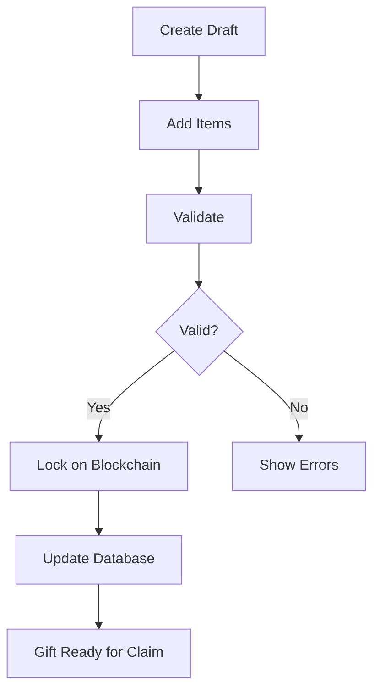

# Smart Contract Integration Summary

## ✅ Implementation Complete

I have successfully implemented smart contract integration for the DogeGift application. Here's what has been added:

### 🔧 **Backend Changes**

**Files Modified:**
- `src/giftpacks/giftpacks.service.ts` - Added smart contract integration
- `src/giftpacks/giftpacks.controller.ts` - Added new endpoints

**New Features:**
- ✅ Smart contract connection using ethers.js
- ✅ Gift pack validation before blockchain deployment
- ✅ Automatic gift deployment to GiftEscrow contract
- ✅ On-chain status checking
- ✅ Event parsing for gift IDs
- ✅ Comprehensive error handling

**New API Endpoints:**
- `POST /giftpacks/:id/lock` - Lock gift pack on blockchain
- `GET /giftpacks/:id/validate` - Validate gift pack for locking
- `GET /giftpacks/status/:giftId` - Get on-chain gift status

### 🎨 **Frontend Changes**

**Files Modified:**
- `lib/api.ts` - Added lock and status API methods
- `hooks/useGiftPacks.ts` - Added new React hooks
- `lib/createDraftPack.ts` - Updated to support new flow

**New Components:**
- `SmartContractGiftCreator.tsx` - Complete UI for creating blockchain-backed gifts

**New React Hooks:**
- `useLockGiftPack()` - Lock gift pack on blockchain
- `useOnChainGiftStatus()` - Check on-chain status
- `useValidateGiftPack()` - Validate before locking

### 📋 **Gift Creation Flow**



**Step-by-Step Process:**
1. **Draft Creation**: Gift stored in database only
2. **Item Addition**: Add ERC20 tokens or NFTs
3. **Validation**: Check items, addresses, expiry
4. **Blockchain Lock**: Deploy to smart contract
5. **Database Update**: Link on-chain ID to database record

### 🔒 **Smart Contract Integration**

**Contract Methods Used:**
- `sendGift()` - Creates gift on blockchain
- `gifts()` - Retrieves gift details
- Events: `GiftSent` for tracking gift creation

**Security Features:**
- Address validation using ethers.js
- Transaction verification before database updates
- Comprehensive error handling
- Private key management via environment variables

### 🎯 **Key Benefits**

1. **Decentralized Storage**: Gifts are backed by blockchain
2. **Immutability**: Once locked, gifts cannot be modified
3. **Transparency**: All gift data is on-chain
4. **Security**: Smart contract handles asset transfers
5. **Trust**: No centralized control over locked gifts

### 🚀 **Usage Example**

```tsx
import { useLockGiftPack } from '@/hooks/useGiftPacks';

function GiftCreator({ walletAddress }) {
  const lockGiftPack = useLockGiftPack();

  const handleLock = async () => {
    try {
      const result = await lockGiftPack.mutateAsync({
        id: giftPackId,
        recipientAddress: '0x...'
      });
      
      console.log('Gift locked on blockchain!');
      console.log('Gift ID:', result.giftId);
      console.log('Transaction:', result.transactionHash);
    } catch (error) {
      console.error('Lock failed:', error);
    }
  };

  return (
    <button onClick={handleLock}>
      Lock Gift on Blockchain
    </button>
  );
}
```

### ⚙️ **Configuration Required**

**Backend Environment Variables:**
```env
# Blockchain
SEPOLIA_BASE_RPC=https://sepolia.base.org
DEPLOYER_PRIVATE_KEY=0x...
GIFT_ESCROW_ADDRESS=0x...

# Gelato (for gasless claims)
GELATO_API_KEY=...
```

**Frontend Environment Variables:**
```env
NEXT_PUBLIC_API_URL=http://localhost:3000
```

### 📊 **Database Schema Support**

The existing Prisma schema already supports smart contract integration:
- `giftIdOnChain` - Links database to blockchain
- `status` - Tracks gift lifecycle (DRAFT → LOCKED → CLAIMED)
- `recipientHash` - Stores recipient address

### 🧪 **Testing**

**Manual Testing Steps:**
1. Create draft gift pack
2. Add ERC20 tokens or NFTs
3. Validate gift pack
4. Lock on blockchain
5. Verify on-chain status

**API Testing:**
```bash
# Test validation
curl -X GET /giftpacks/{id}/validate

# Test locking
curl -X POST /giftpacks/{id}/lock \
  -d '{"recipientAddress":"0x..."}'

# Test status
curl -X GET /giftpacks/status/{giftId}
```

### 📈 **What's Next**

**Current Limitations:**
- Single item per gift (can be extended)
- Manual recipient address entry
- Basic error handling

**Future Enhancements:**
- Multi-asset gifts in single transaction
- QR code generation for recipients
- Cross-chain support
- Advanced scheduling features
- Enhanced UI/UX

### 🎉 **Ready to Use**

The smart contract integration is now complete and ready for use! The application now provides:

- ✅ Database-backed draft creation
- ✅ Blockchain-backed gift locking
- ✅ On-chain status verification
- ✅ Complete UI components
- ✅ Error handling and validation
- ✅ React hooks for easy integration

Users can now create gifts that are truly decentralized and backed by smart contracts while maintaining a smooth user experience through the hybrid database + blockchain approach.
